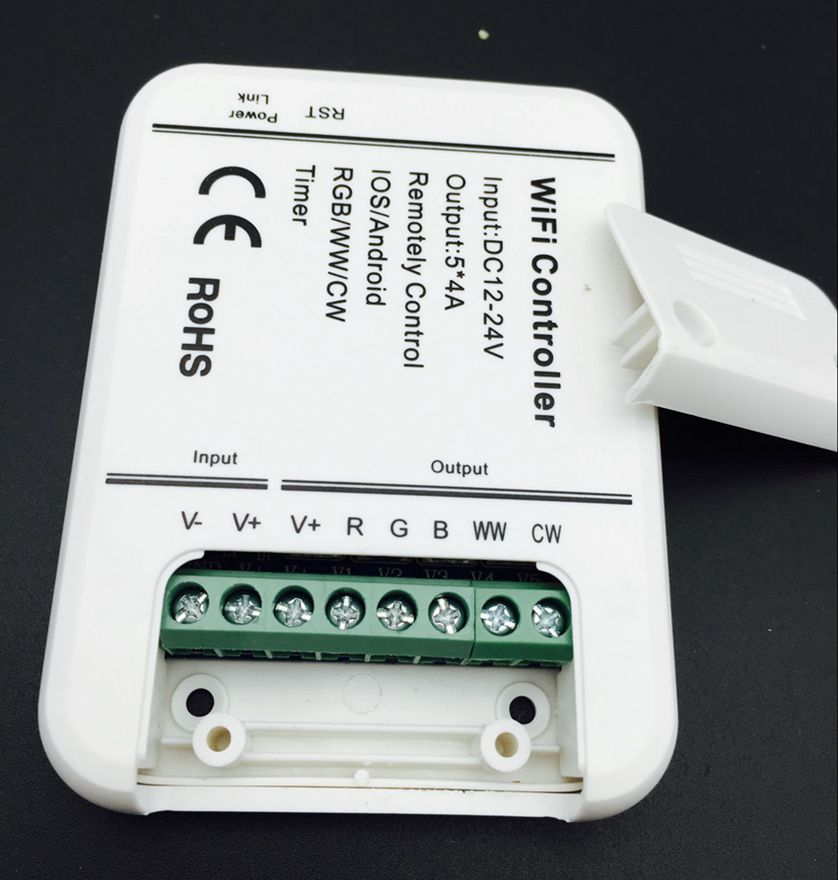

# MagicHome WiFi led controller library, gui and binding
Проект предназначен для интеграции контроллеров светодиодной ленты в систему умного дома. Такие контроллеры выпускаются под разными китайскими брендами. Одним из самых популярных - MagicHome c приложениями для iOs и Android, именно такой конроллер у меня.

# TODO list
- [x] Интегрировать один контроллер 
- [ ] Отладится на нескольких контроллерах (в закупке, прибытие ~ в августе 2016)
- [ ] Релизнуть библиотеку
- [ ] Толстый клиент
- [ ] Веб клиент
- [ ] Байдинг для OpenHAB2
